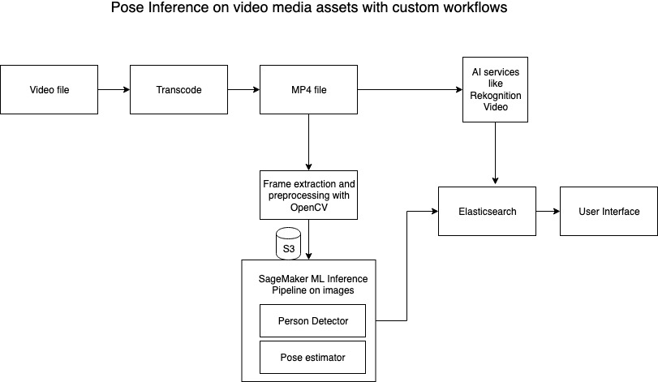

The objective of the workshop is to build custom ML model inference on video assets in Media Insights Engine (MIE) . The use case here is "pose detection" in a video. We will use a SageMaker inference pipeline of 2 pre-trained deep learning models hosted on a single endpoint. 

# Components : 

1) Pre-trained models:

   Top down strategy for pose detection. First, detect persons in bounding boxes from an object detection model. Second, estimate pose from key joints of the body. Gluoncv toolkit on MXNet framework is used here with yolov3 person detector + alpha pose estimator.
   https://gluon-cv.mxnet.io/build/examples_pose/demo_alpha_pose.html#sphx-glr-build-examples-pose-demo-alpha-pose-py
   
2) SageMaker inference pipeline:

   Model inference is hosted on a single SageMaker endpoint with inference pipeline of person detector + pose estimator. A custom MIE operator is created for inference with SageMaker.
   https://docs.aws.amazon.com/sagemaker/latest/dg/inference-pipelines.html
   
3) Serverless video frame processing:

   Video is pre-processed at a desired sampling rate (FPS) to generate image frames and their associated timestamps in S3. This  is achieved with opencv library which is added as a lambda layer. A custom MIE operator is created for video frame processing.
   
4) Custom MIE operators and workflow:

MIE generates workflows using Step Function service state machines. Operators are created by implementing resources (e.g. lambda, sagemaker) that can plug in to MIE state machines as tasks and registering them as operators using the MIE API. 
Operator inputs include a list of Media, Metadata and the operator Configuration plus ids for the workflow execution the operator is part of and the asset the operator is processing.

5) UI integration:

  The web app is modified to include an additional tab for 'Pose'. Pose inference is associated with the timestamp and visualized as an overlay during playback. 
  
  Pre-requisities : 

  AWS account with available limits for 1 ml.g4dn.2xlarge instance for sagemaker hosting. (Alternatively, you can specify another instance type during cloud formation deployment) 
  
  
  
 # Execution steps : 
 
 1. Clone this github repository 

    git clone -b acvc2020 --single-branch https://github.com/awslabs/aws-media-insights-engine.git (HTTPS) 

                                OR

    git clone -b acvc2020 --single-branch git@github.com:awslabs/aws-media-insights-engine.git (SSH)
 
 2. Create a S3 bucket for building MIE with pose inference. 

     DIST_OUTPUT_BUCKET=[enter the name of your bucket here]

     VERSION=[enter an arbitrary version name here]

     REGION=[enter the name of the region in which you would like to build MIE]
     
 3.  [10 minutes] 
      Prerequisites : 

      a) install wget.
      b) install and start docker.

      Run the following build command in your terminal from the deployment directory:

       cd deployment

      ./build-s3-dist.sh $DIST_OUTPUT_BUCKET $VERSION $REGION 

 4. Create a S3 bucket named 'pose-bucket-$REGION-$AccountId' to upload pose inference scripts. 
     NOTE : The bucket has to follow the above format.
     
  5. Copy contents of models/ into the S3 bucket 'pose-bucket-$REGION-$AccountId'

     models/* -> 'pose-bucket-$REGION-$AccountId'/*
     
  6. Make sure account limits are raised to support 1 sagemaker hosting endpoint instance type. For sub-second inference, the default instance type is with GPU  'ml.g4dn.2xlarge'. It is not required to use GPU instance. You can provide another instance type as a parameter during cloud formation deployment. 
  
  7. [20 minutes] Deploy the cloud formation template created in Step 3. 
  
  8. Create a lambda layer for opencv. You can deploy the package pre-built for Amazon Linux available in this repository at opencv/. 
      Detailed steps to build the package can be found here https://github.com/iandow/opencv_aws_lambda
  
  9. Attach the lambda layer to the frame processing operator. Search for '*frameExtractor*' lambda function and add additional layer. 
  
  10. Upload any video .mp4 file (upto 10 minutes in length) through the MIE console. Choose 'Configure workflow' to turn off other AI services if not required. 
Observe the pose inference results in a new tab named 'Pose' . 

  11. Lastly, remember to be frugal and delete your cloud formation stack OR delete the sagemaker endpoint instance (you can recreate it from the stored model and endpoint configuration once again )
  
  
     
     

     
  

