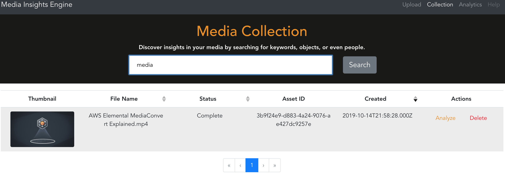

# Getting Started With the Sample Application

This document shows how to get started using the provided sample application with the Media Insights Engine(MIE).

This assumes that MIE has been full deployed at this point. 

## The Upload Page

1. Navigate to the CloudFormation console where you launched MIE.
1. From the **Outputs** tab, copy the value of `WebAppCloudfrontUrl` on to your browser. This should open up the sample application. 
1. Click on the **Upload** link on the top right menu. 
1. Click on **Drop files here to upload**. You may upload any file that's a [supported input type by AWS MediaConvert](https://docs.aws.amazon.com/mediaconvert/latest/ug/reference-codecs-containers-input.html). 
1. After you've selected your file, click on the **Configure Worklow**. 
1. Make sure only the operators you want run are selected. 
1. After selection has been made, click on the **Start Upload and Run Workflow** button. 
1. Once upload has completed and the operators start working on the asset, you should see a workflow status at the bottom of the page as below:

    

## The Collections Page

1. Click on the **Collections** link on the top right menu. This page will show all the assets that have been uploaded for analysis so far, and their corresponding status. 
1. When all the operators selected for the workflow has finished running on the asset, the status will show as **Completed**. 
1. If the status on an asset is set to **Error**:
    
    a. Navigate to the **Step Functions** console.
    
    b. Under **State Machines**, click on `MieCompleteWorkflow`. 
    
    c. Under **Executions**, click on the name of the execution that has the Failed 
    status.
    
    d. Inspect the **Visual Workflow** to determine where in the execution the workflow failed.
    
    e. Click on the **CloudWatch** link to get more information on the failure.

    

1. Data collected from all the analysis are stored in Amazon Elasticsearch Service and can be retrieved using Lucene queries in the Collection view search page. Assets matching the query will show up on the page.

    

1. To view the results from running the workflow operators, click on the **Analyze** link under the **Actions** column for a specific asset.

    

## The Analytics Page

1. Click on the **Analytics** link on the top right menu. This page will send you to Kibana, which allows you to search and visualize the data that's been collected and stored in Elasticsearch.
1. Click on the **Discover** link from the left-hand side menu. This should take you to a page for creating an index pattern if you haven't created one already. 
1. To create an index pattern, enter `mie*` in the **Index pattern** textbox. This will include all the indices that has already been created.
    
    

1. Click on **Next Step**.
1. Click on **Create Index Pattern**.
1. At this point you're ready to run some queries and visualizations. 

